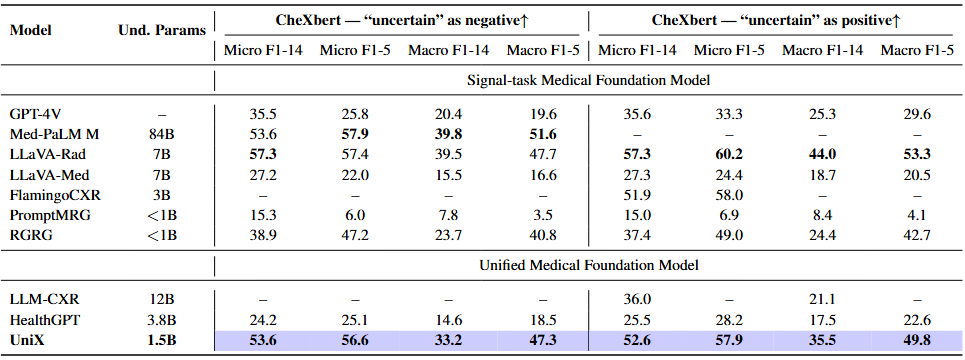
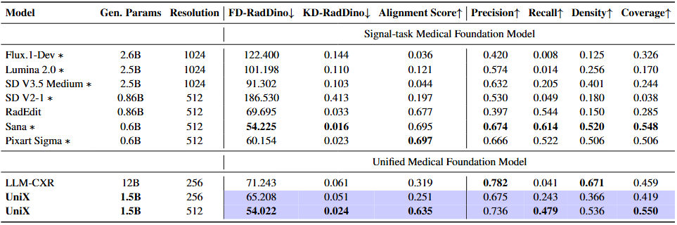

<div align="center">

<h1 align="center">
UniX: Unifying Autoregression and Diffusion for <br> Chest X-Ray Understanding and Generation
</h1>
<p align="center">
<b>🔥 Better Unified Performance with 25% Parameters: +46.1% Understanding & +24.2% Generation Quality!</b>
</p>
<p align="center">
  <a href="https://github.com/ZrH42">Ruiheng Zhang</a><sup>1,*</sup>, &nbsp;
  <a href="https://github.com/JingfengYao">Jingfeng Yao</a><sup>2,*</sup>, &nbsp;
  <a href="https://scholar.google.com/citations?hl=zh-CN&user=AaQm4aYAAAAJ">Huangxuan Zhao</a><sup>1,*,✉️</sup>, &nbsp;
  <a href="https://github.com/xuenai1234">Hao Yan</a><sup>1</sup>, &nbsp;
  <a href="https://scholar.google.com/citations?user=fWi66HcAAAAJ&hl=zh-CN&oi=ao">Xiao He</a><sup>1</sup>, &nbsp;
  <a href="https://orcid.org/0000-0003-0018-9993">Lei Chen</a><sup>2</sup>, <br>
  Zhou Wei</a><sup>1</sup>, &nbsp;
  <a href="https://scholar.google.com/citations?user=zb1oVGIAAAAJ&hl=en">Yong Luo</a><sup>1</sup>, &nbsp;
  <a href="https://scholar.google.com.hk/citations?user=tTqiJpQAAAAJ&hl=zh-CN">Zengmao Wang</a><sup>1</sup>, &nbsp;
  <a href="https://scholar.google.com/citations?user=BLKHwNwAAAAJ">Lefei Zhang</a><sup>1</sup>, &nbsp;
  <a href="https://scholar.google.com/citations?user=RwlJNLcAAAAJ">Dacheng Tao</a><sup>3</sup>, &nbsp;
  <a href="https://scholar.google.com/citations?user=Shy1gnMAAAAJ&hl=zh-CN">Bo Du</a><sup>1,✉️</sup>
</p>

<p align="center">
  <span><sup>1</sup>Wuhan University</span> &emsp; 
  <span><sup>2</sup>Huazhong University of Science and Technology</span> &emsp; 
  <span><sup>3</sup>Nanyang Technological University</span>
</p>

<p align="center" style="font-size: 0.9em; margin-top: -10px;">
  <sup>*</sup>equal contribution &emsp; ✉️ corresponding author
</p>
<p align="center">
  <a href="https://arxiv.org/abs/2601.11522"></a>&nbsp;<a href="https://huggingface.co/ZrH42/UniX"></a>&nbsp;<a href="https://www.modelscope.cn/models/ZrH4321/UniX">
</a>
</p>
</div>

## 📰 News

- **[2026.01.19]** 🎉 Our paper **UniX** is released on arXiv! We also release the weights on Hugging Face.

## 🚀 Release Plan
- [x] Release paper
- [x] Release UniX model weights
- [x] Release inference code (CLI & Gradio WebUI)
- [x] Release evaluation code
- [ ] Release training code (coming soon)

## ⚡ Quick Start

1. **Install Environment** 
   
   ```bash
   git clone https://github.com/ZrH42/UniX.git
   cd UniX
   conda create -n unix python=3.10 -y
   conda activate unix
   bash install.sh
   ```
   
2. **Download Weights at [HuggingFace](https://huggingface.co/ZrH42/UniX) or [ModelScope](https://www.modelscope.cn/models/ZrH4321/UniX)**
   
   ```
   weights/
      └── UniX/
   ```
   
3. **Launch Gradio Demo**
   ```bash
   python demo_gradio.py
   ```

## 📄 Introduction
  <div align="center">
  
  </div>
Unified medical modeling has emerged as a promising direction for generalist clinical AI, offering the potential to integrate reasoning and synthesis. However, existing unified medical foundation models largely lag behind specialized single-task models in performance, primarily due to the inherent conflict between semantic abstraction and pixel-level reconstruction objectives. 

**UniX bridges this gap by answering a fundamental question: Can we decouple these conflicting goals while maintaining deep synergy?** We propose a dual-branch architecture that "unifies" autoregressive understanding and diffusion generation through structural decoupling and dynamic coordination. Unlike prior parameter-sharing approaches restricted by feature interference, UniX introduces a novel Cross-Modal Self-Attention mechanism. This allows for precise semantic guidance during generation without degrading comprehension. With this integrated design, utilizing only 25% of the parameters required by previous methods like LLM-CXR, UniX achieves state-of-the-art performance among unified models, delivering a 46.1% improvement in understanding and a 24.2% gain in generation quality.

## ✨ Highlights

- **Decoupled Dual-Branch Architecture:** Unifies autoregressive understanding and diffusion-based generation to fundamentally resolve intrinsic task conflicts and feature interference.

- **Superior Efficiency & Quality:** Achieves unified performance with **only 25% parameters** while boosting understanding by **46.1%** and generation quality by **24.2%**.

- **Cross-Modal Synergy:** Introduces a novel self-attention mechanism that enables dynamic semantic guidance for high-fidelity, continuous medical image synthesis.

  <div align="center">
  
  
  </div>


## 🚀 Get Started

| Document | Description |
| :--- | :--- |
| [Installation](docs/INSTALLATION.md) | Environment setup and model preparation |
| [Inference & Evaluation](docs/INFERENCE_EVALUATION.md)                       | Quick inference with pre-trained weights and evaluate |


## ❤️ Acknowledgements

This repo is mainly built on [BAGEL](https://github.com/bytedance-seed/BAGEL), [Janus-Pro](https://github.com/kinsDev/Janus-Pro), [REPA](https://github.com/sihyun-yu/REPA), [latent-diffusion](https://github.com/CompVis/latent-diffusion), [CheXbert](https://github.com/stanfordmlgroup/CheXbert), [CheXGenBench](https://github.com/Raman1121/CheXGenBench). We thank the authors for their open-source contributions.

## 📝 Citation
If you find our work useful, please cite our paper:
```
@article{zhang2026unix,
  title={UniX: Unifying Autoregression and Diffusion for Chest X-Ray Understanding and Generation},
  author={Zhang, Ruiheng and Yao, Jingfeng and Zhao, Huangxuan and Yan, Hao and He, Xiao and Chen, Lei and Wei, Zhou and Luo, Yong and Wang, Zengmao and Zhang, Lefei and Tao, Dacheng and Du, Bo},
  journal={arXiv preprint arXiv:2601.11522},
  year={2026}
}
```

